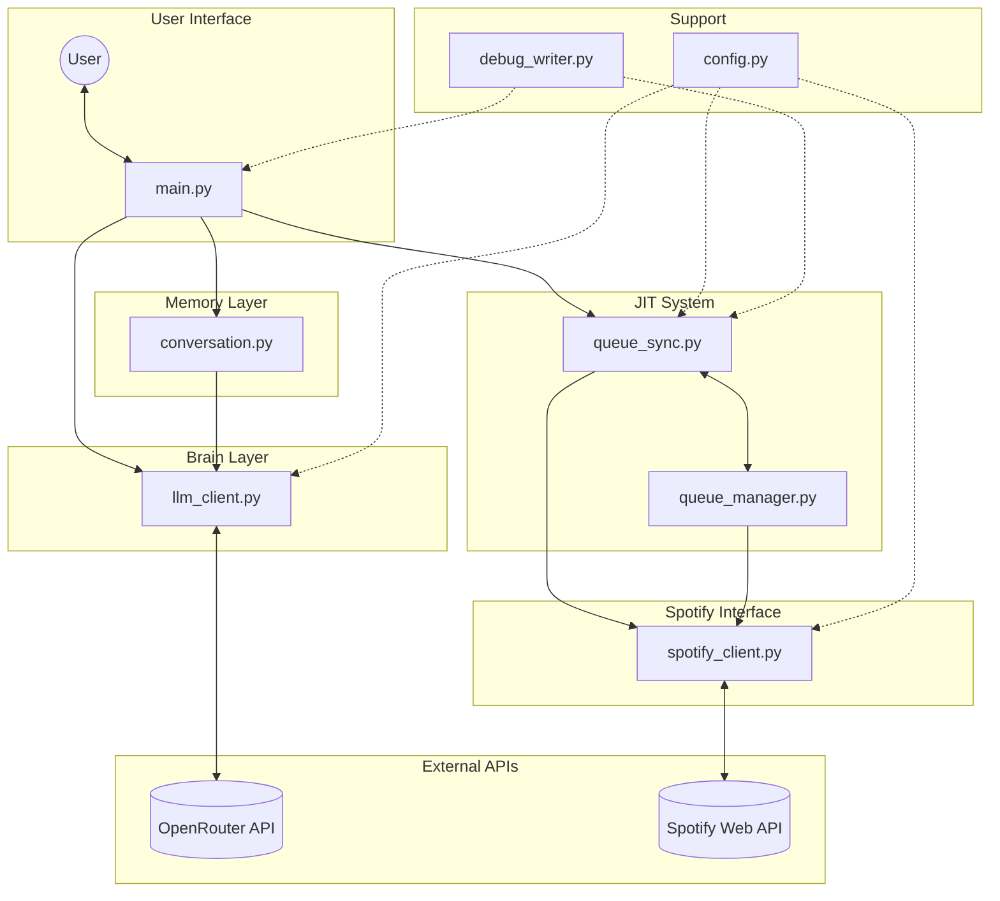

# Spotify DJ - Architecture Overview

**Generated**: Based on git status, beads status, and codebase analysis

---

## Project Summary

**Spotify DJ** is a conversational CLI app that uses an LLM (via OpenRouter) to interpret natural language music requests and controls Spotify playback. The clever innovation is a **Just-In-Time (JIT) injection system** that bypasses Spotify's API limitation of not being able to remove songs from a queue.

---

## Beads (Issue Tracker) Status

| Issue | Priority | Status | Description |
|-------|----------|--------|-------------|
| `spotify_dj-4bz` | P0 | open | **BLOCKER**: Spotify API can't remove songs from queue |
| `spotify_dj-7km` | P0 | open | Task 4: Queue Sync Engine |
| `spotify_dj-dia` | P1 | open | Task 7: Polish & Edge Cases |
| `spotify_dj-gos` | P0 | closed | Task 4.5: JIT Queue Injection System |
| `spotify_dj-8yu` | P0 | closed | Task 3: LLM API Client |
| `spotify_dj-c6i` | P0 | closed | Task 5: Conversation History |
| `spotify_dj-926` | P0 | closed | Task 6: CLI Loop & Main Application |

**Ready work**: `spotify_dj-7km` (Queue Sync Engine) and `spotify_dj-dia` (Polish)

---

## System Architecture Diagram



---

## File-by-File Breakdown

### Core Application Files

#### `main.py` - CLI Entry Point
**Role**: User interface and orchestration

| Function | Purpose |
|----------|---------|
| `display_welcome()` | Shows welcome banner with usage examples |
| `should_exit()` | Checks for exit keywords (exit, quit, bye, stop) |
| `format_queue_for_display()` | Pretty-prints queue (first 5 songs) |
| `main()` | Main REPL loop - coordinates all components |

**Flow**:
1. Initialize SpotifyClient, LLMClient, ConversationHistory
2. Loop: Get input -> Fetch queue -> Call LLM -> Start/Update JIT session
3. Handle errors gracefully, maintain session state

---

#### `llm_client.py` - The Brain
**Role**: Translates natural language into structured queue data

| Method | Purpose |
|--------|---------|
| `__init__()` | Loads OpenRouter API key from config |
| `_get_system_prompt()` | DJ curator prompt - instructs LLM to return JSON |
| `get_queue_suggestion()` | Main API: history + queue + request -> suggested songs |
| `_extract_json_from_response()` | Robust JSON extraction (handles markdown, raw, embedded) |
| `_normalize_queue_response()` | Handles both `[...]` and `{"queue": [...]}` formats |
| `_validate_queue_structure()` | Ensures each song has title + artist |

**Key Design**: Uses `response_format: {"type": "json_object"}` for guaranteed JSON output.

**Input/Output**:
```
INPUT:  conversation_history, current_queue, user_message
OUTPUT: [{"title": "Song Name", "artist": "Artist Name"}, ...]
```

---

#### `queue_sync.py` - The Heartbeat (JIT Engine)
**Role**: Keeps music playing by injecting songs just-in-time

| Class/Method | Purpose |
|--------------|---------|
| `JITQueueSync` | Main JIT orchestrator |
| `start_dj_session()` | Initialize with songs, start first track |
| `run_injection_loop()` | Background polling loop (every 1.5s) |
| `update_shadow_queue()` | Mid-session queue replacement |
| `start_injection_thread()` | Spawns background daemon thread |
| `QueueSync` | Legacy wrapper for compatibility |

**The JIT Logic Explained**:
```mermaid
sequenceDiagram
    participant Loop as Injection Loop
    participant Spotify as Spotify API
    participant Shadow as Shadow Queue
    
    Note over Spotify: Playing Song A (3:00)
    
    loop Every 1.5 seconds
        Loop->>Spotify: Get playback status
        Spotify-->>Loop: Time remaining: 45s
        Note over Loop: Not yet...
    end
    
    Loop->>Spotify: Get playback status
    Spotify-->>Loop: Time remaining: 12s
    Note over Loop: < 15s threshold!
    
    Loop->>Shadow: Get next song URI
    Shadow-->>Loop: Song B URI
    Loop->>Spotify: Add Song B to queue
    
    Note over Spotify: Song A ends, plays Song B
    
    Note over Loop: User says "Switch to jazz!"
    Loop->>Shadow: Replace queue with jazz songs
    
    Note over Loop: Next injection will be jazz
```

**Why JIT?**: Spotify API cannot remove songs from queue. If we added 20 pop songs and user wants jazz, we're stuck. JIT only adds 1 song at a time, right before needed.

---

#### `queue_manager.py` - The Memory (Shadow Queue)
**Role**: Maintains the intended playlist outside Spotify

| Method | Purpose |
|--------|---------|
| `__init__()` | Takes song list, resolves all to Spotify URIs upfront |
| `update_queue()` | Replace entire queue (thread-safe) |
| `get_next_song()` | Pop next song tuple (title, artist) |
| `peek_next_song()` | Look at next without removing |
| `get_next_track_uri()` | Get URI for injection |
| `is_empty()` | Check if more songs available |
| `queue_length()` | Count remaining songs |

**Thread Safety**: All methods use `threading.Lock()` to prevent race conditions between the injection loop and user updates.

---

#### `spotify_client.py` - The Hands
**Role**: Direct interface with Spotify via `spotipy` library

| Method | Purpose |
|--------|---------|
| `__init__()` | OAuth setup with required scopes |
| `get_current_queue()` | Fetch currently playing + queued tracks |
| `search_track()` | Title/artist -> Spotify URI |
| `start_playback()` | Begin playing a specific track |
| `get_playback_status()` | Progress, duration, device info |
| `calculate_time_until_end()` | Seconds remaining in current track |
| `should_inject_next()` | True if < 15s remaining |
| `inject_next_song()` | Add URI to Spotify queue |
| `clear_queue()` | **STUB** - not possible via API |

**Required Scopes**: `user-read-playback-state`, `user-modify-playback-state`

---

#### `conversation.py` - Session Memory
**Role**: Tracks chat history for LLM context

| Method | Purpose |
|--------|---------|
| `add_user_message()` | Append user message to history |
| `add_assistant_response()` | Append assistant response |
| `get_history()` | Return copy in LLM API format |
| `clear()` | Reset conversation |

**Format**: `[{"role": "user", "content": "..."}, {"role": "assistant", "content": "..."}]`

---

### Configuration & Support Files

#### `config.py` - Central Configuration
**Role**: All settings in one place

| Class | Settings |
|-------|----------|
| `LLMConfig` | API endpoint, model (`x-ai/grok-code-fast-1`), timeout (30s) |
| `SpotifyConfig` | Client ID/Secret, redirect URI, scopes |
| `JITConfig` | Injection threshold (15s), poll interval (1.5s), retries (3) |
| `AppConfig` | App name, debug flag |

---

#### `debug_writer.py` - Session Logging
**Role**: JSONL debug logs for troubleshooting

| Method | Purpose |
|--------|---------|
| `log_cycle()` | Periodic snapshot of system state |
| `log_event()` | Discrete events (injection, song_change, etc.) |
| `log_error()` | Error recording with timestamp |
| `create_cycle_snapshot()` | Helper to build cycle data |

**Output**: `logs/session_{timestamp}_{pid}.jsonl`

---

## Data Flow Diagram

```mermaid
flowchart LR
    subgraph Input
        A[User: Play some jazz]
    end
    
    subgraph Processing
        B[main.py receives input]
        C[spotify_client fetches current queue]
        D[conversation.py stores message]
        E[llm_client sends to OpenRouter]
        F[LLM returns JSON queue]
    end
    
    subgraph Output
        G[queue_manager resolves URIs]
        H[queue_sync starts/updates session]
        I[Injection loop runs in background]
        J[Songs play on Spotify]
    end
    
    A --> B --> C --> D --> E --> F --> G --> H --> I --> J
```



---

## The Key Innovation: Why JIT?

### The Problem
```
Spotify Web API Limitation:
- CAN read queue
- CAN add to queue  
- CANNOT remove from queue  <-- This breaks everything
```

### The Solution
Instead of:
```
1. Clear queue (IMPOSSIBLE)
2. Add 20 songs
3. User changes mind -> stuck with wrong songs
```

We do:
```
1. Keep songs in Python "shadow queue"
2. Only add 1 song to Spotify at a time
3. Add it ~15 seconds before current song ends
4. User changes mind -> just update shadow queue
5. Next injection uses new songs!
```

---

## Test Files

| File | Tests |
|------|-------|
| `test_spotify_client.py` | Spotify API integration |
| `test_llm_client.py` | LLM API and JSON extraction |
| `test_llm_extraction.py` | JSON parsing edge cases |
| `test_queue_sync.py` | Queue sync logic |
| `test_jit_queue.py` | JIT injection system |
| `test_conversation.py` | Conversation history |

---

## Running the Application

```bash
# Setup
cp .env.example .env
# Fill in: SPOTIFY_CLIENT_ID, SPOTIFY_CLIENT_SECRET, 
#          SPOTIFY_REDIRECT_URI, OPENROUTER_API_KEY

# Run
.venv/bin/python main.py

# Run with debug logging
.venv/bin/python main.py --debug
```

---

## Current Status

**Working**:
- Spotify authentication and queue fetching
- LLM integration with robust JSON parsing
- JIT injection system (background thread)
- Conversation history
- CLI loop

**Known Issue** (`spotify_dj-4bz`):
- The Spotify API limitation is worked around via JIT, but the original `clear_queue()` approach is documented as not viable.

**Remaining Work**:
- `spotify_dj-7km`: Queue Sync Engine refinements
- `spotify_dj-dia`: Polish & edge cases
