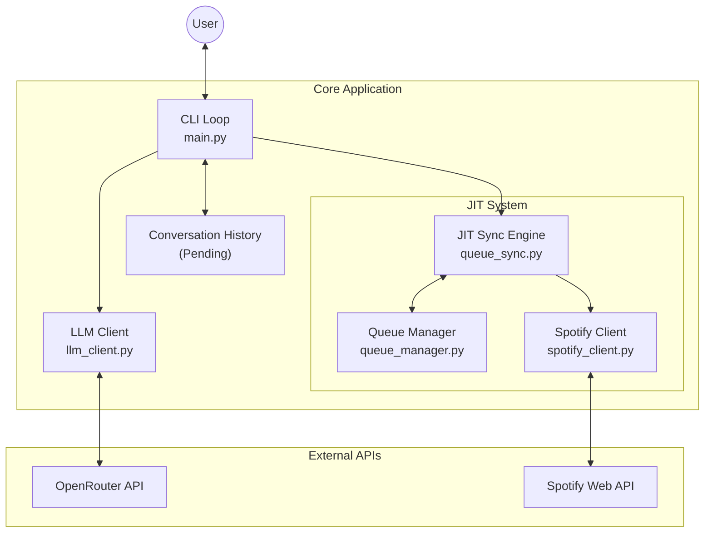
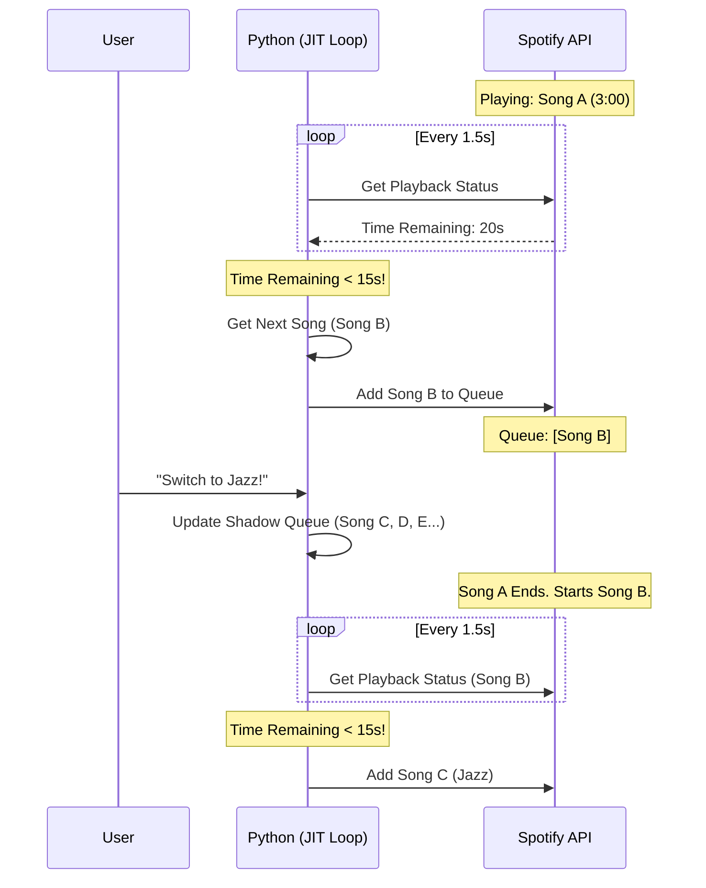

# Spotify DJ - Current Project State

**Date:** January 16, 2026
**Status:** Core Logic Implemented (JIT System), UI/CLI Pending

## 1. Project Overview

**Spotify DJ** is a conversational CLI application that acts as an intelligent music curator.
*   **User Input:** Natural language (e.g., "Play some upbeat 80s city pop").
*   **Intelligence:** Uses an LLM (OpenRouter) to interpret requests and generate playlists.
*   **Playback:** Controls Spotify directly.
*   **Key Innovation:** Uses a **Just-In-Time (JIT) Injection System** to bypass Spotify's API limitations (specifically, the inability to clear the queue), allowing for dynamic, mid-session playlist changes.

---

## 2. System Architecture

---

## 3. Component Breakdown

### 🧠 The Brain: `llm_client.py`
*   **Role:** Translates natural language into structured data.
*   **Input:** Conversation history + Current Queue + User Request.
*   **Output:** JSON array of songs `[{"title": "...", "artist": "..."}]`.
*   **Key Logic:** Includes a robust JSON extractor to handle variable LLM output formats.

### 🗃️ The Memory: `queue_manager.py`
*   **Role:** Maintains the "Shadow Queue" — the list of songs the DJ *intends* to play, which exists outside of Spotify.
*   **Key Logic:** 
    *   Resolves Song Title/Artist to Spotify URIs immediately upon receiving them.
    *   Tracks the `current_index` (what song is next).
    *   **Note:** Identified as having a potential race condition during updates (see Section 5).

### 🩺 The Heartbeat: `queue_sync.py`
*   **Role:** Runs the injection loop. It keeps the music playing.
*   **Logic:**
    *   Starts a background thread.
    *   Polls Spotify every 1.5 seconds.
    *   When the current song is within 15 seconds of ending, it "injects" the next song from the `QueueManager` into the real Spotify queue.

### 🛠️ The Hands: `spotify_client.py`
*   **Role:** Direct interface with `spotipy` library.
*   **Capabilities:**
    *   `search_track()`: Finds Spotify URIs.
    *   `get_playback_status()`: Checks progress (ms) and duration.
    *   `should_inject_next()`: Calculates if it's time to add a song.

---

## 4. The JIT (Just-In-Time) Logic Explained

Why do we need this? **The Spotify API does not allow us to remove songs from the queue.**
If we added 20 songs to the queue, and the user said "Actually, I want jazz," we couldn't remove the 19 pop songs pending.

**The Solution:**
We keep the songs in our own Python list (`QueueManager`) and only give Spotify **one song at a time**, right before it's needed.

---

## 5. Current File Structure & Responsibility

| File | Responsibility | Status |
| :--- | :--- | :--- |
| `config.py` | Central configuration (API keys, Timeouts, Constants). | ✅ Complete |
| `main.py` | CLI Entry point. Currently empty. | ⏳ Pending |
| `llm_client.py` | OpenRouter communication & Prompt engineering. | ✅ Complete |
| `queue_manager.py` | Manages the list of songs to be played. | ⚠️ Needs Fix (Race Condition) |
| `queue_sync.py` | The threaded loop that injects songs. | ✅ Complete |
| `spotify_client.py` | Spotify API wrapper. | ✅ Complete |
| `test_*.py` | Unit tests for various components. | ✅ Passing |

## 6. Immediate Next Steps

1.  **Fix Race Condition:** `QueueManager` needs thread locks to safely handle user updates while the background loop is reading.
2.  **Implement `conversation.py`:** To track chat history.
3.  **Build `main.py`:** The actual user interface loop.
